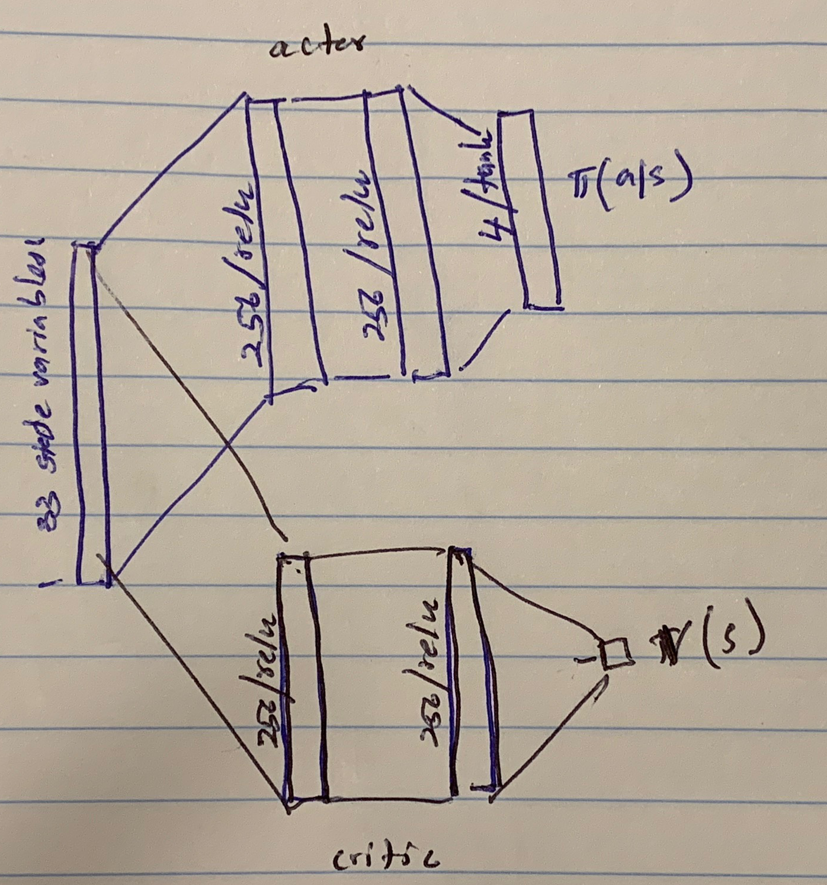
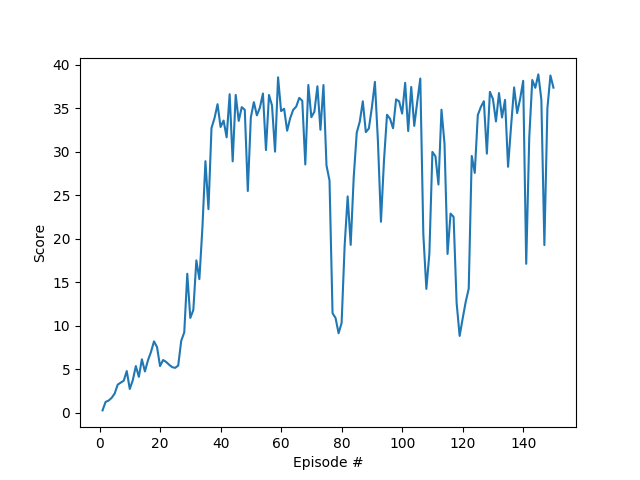

# Project 2: Continuous Control
## Saminda Abeyruwan

### Introduction

In this project, we have trained and evaluated an agent on the [Reacher](https://github.com/Unity-Technologies/ml-agents/blob/master/docs/Learning-Environment-Examples.md#reacher) environment.

In this environment, a double-jointed arm can move to target locations. A reward of +0.1 is provided for each step that the agent's hand is in the goal location. Thus, the goal of our agent is to maintain its position at the target location for as many time steps as possible.

### Environment

We have used the __version 2__ environment for training and evaluation of the agent. It consists of 20 identical agents, each with its own copy of the environment. To solve the problem, the agents must get an average score of +30 (over 100 consecutive episodes, and over all agents).  Therefore,

* After each episode, we add up the rewards that each agent received (without discounting), to get a score for each agent.  This yields 20 (potentially different) scores.  We then take the average of these 20 scores. 
* This yields an **average score** for each episode (where the average is over all 20 agents).

### State and Action Representation

The observation space consists of 33 variables corresponding to position, rotation, velocity, angular velocities of the arm, and so on. Each action is a vector with four numbers, corresponding to torque applicable to two joints. Every entry in the action vector should be a number between -1 and 1.

### A2C

We have implemented _Continuous Synchronous Advantage Actor Critic_ ([A2C](https://arxiv.org/pdf/1602.01783v1.pdf)). This is similar to [A3C](https://arxiv.org/pdf/1602.01783v1.pdf), where the global network weight update step has been synchronized. This is an on-line actor-critic variant, which has been stable under many different tasks. In addition, we have also used multi-step TD error as described in [Generalized Advantage Estimation](https://arxiv.org/pdf/1506.02438.pdf). We have used the following actor-critic network:

The actor consists of input layer with 33 state variables followed by two hidden layers with 256 units using relu activation. The output layer has four units using tanh activation. Since the output of the agent must be continuous, and we have used Multi-variant Gaussian. The mean is the output of the last layer, and we have used fixed unit covariance. The action value has been sampled from Gaussian. 

The critic is similar to actor expect the last layer, where we have used one linear activation to represent the state-value function. Using the network and the [_Algorithm 3_](https://arxiv.org/pdf/1602.01783v1.pdf), our implementation has been used to solve the Reacher environment. The A2C does not require a reply buffer, but a variant that uses a reply buffer also available [here](https://arxiv.org/pdf/1611.01224.pdf). 

### Training

There are many knobs to tune in the algorithm. The parameters that worked best for me are:

| Parameter      | Value         | 
| ---------------|:-------------:| 
| entropy\_weight |  0.01        |
| rollout\_length  |  5        |
| value\_loss\_weight   |     1.0        |
| learning\_rate  |    0.0007        |

We have used RMSProp as the optimizer. The agent has solved the problem within __134 episodes__, and the weights are saved in [model-A2CAgent.bin](model-A2CAgent.bin).

Following is the learning trace:

	(drlnd) saminda:DRLND_p2_continuous_control saminda$ python a2c_agent.py
	Mono path[0] = '/Users/saminda/Udacity/DRLND/Sim/Reacher20/Reacher.app/Contents/Resources/Data/Managed'
	Mono config path = '/Users/saminda/Udacity/DRLND/Sim/Reacher20/Reacher.app/Contents/MonoBleedingEdge/etc'
	INFO:unityagents:
	'Academy' started successfully!
	Unity Academy name: Academy
	        Number of Brains: 1
	        Number of External Brains : 1
	        Lesson number : 0
	        Reset Parameters :
			goal_speed -> 1.0
			goal_size -> 5.0
	Unity brain name: ReacherBrain
	        Number of Visual Observations (per agent): 0
	        Vector Observation space type: continuous
	        Vector Observation space size (per agent): 33
	        Number of stacked Vector Observation: 1
	        Vector Action space type: continuous
	        Vector Action space size (per agent): 4
	        Vector Action descriptions: , , ,
	Brain name: ReacherBrain
	Number of agents: 20
	Size of each action: 4
	INFO:a2c_agent:total episodes 1, returns(last 100) 0.25/0.25 (mean/median), 6.89 s
	INFO:a2c_agent:total episodes 2, returns(last 100) 0.73/0.73 (mean/median), 6.47 s
	INFO:a2c_agent:total episodes 3, returns(last 100) 0.95/1.22 (mean/median), 6.45 s
	INFO:a2c_agent:total episodes 4, returns(last 100) 1.13/1.30 (mean/median), 6.47 s
	INFO:a2c_agent:total episodes 5, returns(last 100) 1.34/1.38 (mean/median), 6.53 s
	INFO:a2c_agent:total episodes 6, returns(last 100) 1.65/1.53 (mean/median), 6.51 s
	INFO:a2c_agent:total episodes 7, returns(last 100) 1.91/1.68 (mean/median), 6.52 s
	INFO:a2c_agent:total episodes 8, returns(last 100) 2.13/1.94 (mean/median), 6.47 s
	INFO:a2c_agent:total episodes 9, returns(last 100) 2.42/2.19 (mean/median), 6.44 s
	INFO:a2c_agent:total episodes 10, returns(last 100) 2.45/2.45 (mean/median), 6.54 s
	INFO:a2c_agent:total episodes 11, returns(last 100) 2.57/2.71 (mean/median), 6.61 s
	INFO:a2c_agent:total episodes 12, returns(last 100) 2.80/2.96 (mean/median), 6.47 s
	INFO:a2c_agent:total episodes 13, returns(last 100) 2.90/3.20 (mean/median), 6.47 s
	INFO:a2c_agent:total episodes 14, returns(last 100) 3.13/3.32 (mean/median), 6.45 s
	INFO:a2c_agent:total episodes 15, returns(last 100) 3.23/3.44 (mean/median), 6.48 s
	INFO:a2c_agent:total episodes 16, returns(last 100) 3.41/3.55 (mean/median), 6.49 s
	INFO:a2c_agent:total episodes 17, returns(last 100) 3.62/3.66 (mean/median), 6.46 s
	INFO:a2c_agent:total episodes 18, returns(last 100) 3.87/3.69 (mean/median), 6.43 s
	INFO:a2c_agent:total episodes 19, returns(last 100) 4.06/3.72 (mean/median), 6.57 s
	INFO:a2c_agent:total episodes 20, returns(last 100) 4.13/3.91 (mean/median), 6.52 s
	INFO:a2c_agent:total episodes 21, returns(last 100) 4.22/4.11 (mean/median), 6.79 s
	INFO:a2c_agent:total episodes 22, returns(last 100) 4.29/4.42 (mean/median), 6.45 s
	INFO:a2c_agent:total episodes 23, returns(last 100) 4.34/4.73 (mean/median), 6.42 s
	INFO:a2c_agent:total episodes 24, returns(last 100) 4.38/4.75 (mean/median), 6.48 s
	INFO:a2c_agent:total episodes 25, returns(last 100) 4.41/4.77 (mean/median), 6.52 s
	INFO:a2c_agent:total episodes 26, returns(last 100) 4.45/4.95 (mean/median), 6.51 s
	INFO:a2c_agent:total episodes 27, returns(last 100) 4.59/5.14 (mean/median), 6.45 s
	INFO:a2c_agent:total episodes 28, returns(last 100) 4.75/5.18 (mean/median), 6.47 s
	INFO:a2c_agent:total episodes 29, returns(last 100) 5.14/5.22 (mean/median), 6.49 s
	INFO:a2c_agent:total episodes 30, returns(last 100) 5.33/5.28 (mean/median), 6.52 s
	INFO:a2c_agent:total episodes 31, returns(last 100) 5.54/5.34 (mean/median), 6.64 s
	INFO:a2c_agent:total episodes 32, returns(last 100) 5.91/5.34 (mean/median), 6.44 s
	INFO:a2c_agent:total episodes 33, returns(last 100) 6.20/5.34 (mean/median), 6.50 s
	INFO:a2c_agent:total episodes 34, returns(last 100) 6.64/5.37 (mean/median), 6.42 s
	INFO:a2c_agent:total episodes 35, returns(last 100) 7.28/5.40 (mean/median), 6.57 s
	INFO:a2c_agent:total episodes 36, returns(last 100) 7.72/5.45 (mean/median), 6.48 s
	INFO:a2c_agent:total episodes 37, returns(last 100) 8.40/5.50 (mean/median), 6.47 s
	INFO:a2c_agent:total episodes 38, returns(last 100) 9.07/5.66 (mean/median), 6.48 s
	INFO:a2c_agent:total episodes 39, returns(last 100) 9.75/5.82 (mean/median), 6.50 s
	INFO:a2c_agent:total episodes 40, returns(last 100) 10.32/5.91 (mean/median), 6.60 s
	INFO:a2c_agent:total episodes 41, returns(last 100) 10.89/6.00 (mean/median), 6.73 s
	INFO:a2c_agent:total episodes 42, returns(last 100) 11.38/6.02 (mean/median), 6.44 s
	INFO:a2c_agent:total episodes 43, returns(last 100) 11.97/6.04 (mean/median), 6.52 s
	INFO:a2c_agent:total episodes 44, returns(last 100) 12.35/6.08 (mean/median), 6.45 s
	INFO:a2c_agent:total episodes 45, returns(last 100) 12.89/6.12 (mean/median), 6.56 s
	INFO:a2c_agent:total episodes 46, returns(last 100) 13.34/6.54 (mean/median), 6.54 s
	INFO:a2c_agent:total episodes 47, returns(last 100) 13.80/6.96 (mean/median), 6.59 s
	INFO:a2c_agent:total episodes 48, returns(last 100) 14.24/7.24 (mean/median), 6.53 s
	INFO:a2c_agent:total episodes 49, returns(last 100) 14.47/7.53 (mean/median), 6.57 s
	INFO:a2c_agent:total episodes 50, returns(last 100) 14.86/7.86 (mean/median), 6.59 s
	INFO:a2c_agent:total episodes 51, returns(last 100) 15.27/8.18 (mean/median), 6.84 s
	INFO:a2c_agent:total episodes 52, returns(last 100) 15.63/8.21 (mean/median), 6.56 s
	INFO:a2c_agent:total episodes 53, returns(last 100) 16.00/8.25 (mean/median), 6.57 s
	INFO:a2c_agent:total episodes 54, returns(last 100) 16.38/8.73 (mean/median), 6.57 s
	INFO:a2c_agent:total episodes 55, returns(last 100) 16.63/9.21 (mean/median), 6.58 s
	INFO:a2c_agent:total episodes 56, returns(last 100) 16.98/10.04 (mean/median), 6.56 s
	INFO:a2c_agent:total episodes 57, returns(last 100) 17.30/10.87 (mean/median), 6.55 s
	INFO:a2c_agent:total episodes 58, returns(last 100) 17.52/11.33 (mean/median), 6.51 s
	INFO:a2c_agent:total episodes 59, returns(last 100) 17.88/11.79 (mean/median), 6.54 s
	INFO:a2c_agent:total episodes 60, returns(last 100) 18.16/13.56 (mean/median), 6.64 s
	INFO:a2c_agent:total episodes 61, returns(last 100) 18.43/15.34 (mean/median), 6.87 s
	INFO:a2c_agent:total episodes 62, returns(last 100) 18.66/15.65 (mean/median), 6.54 s
	INFO:a2c_agent:total episodes 63, returns(last 100) 18.90/15.95 (mean/median), 6.60 s
	INFO:a2c_agent:total episodes 64, returns(last 100) 19.15/16.72 (mean/median), 6.60 s
	INFO:a2c_agent:total episodes 65, returns(last 100) 19.39/17.49 (mean/median), 6.61 s
	INFO:a2c_agent:total episodes 66, returns(last 100) 19.65/19.37 (mean/median), 6.55 s
	INFO:a2c_agent:total episodes 67, returns(last 100) 19.89/21.26 (mean/median), 6.55 s
	INFO:a2c_agent:total episodes 68, returns(last 100) 20.02/22.32 (mean/median), 6.59 s
	INFO:a2c_agent:total episodes 69, returns(last 100) 20.27/23.38 (mean/median), 6.50 s
	INFO:a2c_agent:total episodes 70, returns(last 100) 20.47/24.42 (mean/median), 6.60 s
	INFO:a2c_agent:total episodes 71, returns(last 100) 20.67/25.46 (mean/median), 6.90 s
	INFO:a2c_agent:total episodes 72, returns(last 100) 20.90/26.99 (mean/median), 6.58 s
	INFO:a2c_agent:total episodes 73, returns(last 100) 21.06/28.52 (mean/median), 6.53 s
	INFO:a2c_agent:total episodes 74, returns(last 100) 21.28/28.69 (mean/median), 6.53 s
	INFO:a2c_agent:total episodes 75, returns(last 100) 21.38/28.52 (mean/median), 6.60 s
	INFO:a2c_agent:total episodes 76, returns(last 100) 21.45/28.46 (mean/median), 6.62 s
	INFO:a2c_agent:total episodes 77, returns(last 100) 21.32/28.40 (mean/median), 6.56 s
	INFO:a2c_agent:total episodes 78, returns(last 100) 21.18/27.54 (mean/median), 6.57 s
	INFO:a2c_agent:total episodes 79, returns(last 100) 21.03/26.67 (mean/median), 6.57 s
	INFO:a2c_agent:total episodes 80, returns(last 100) 20.90/26.07 (mean/median), 6.61 s
	INFO:a2c_agent:total episodes 81, returns(last 100) 20.88/25.46 (mean/median), 6.85 s
	INFO:a2c_agent:total episodes 82, returns(last 100) 20.92/25.15 (mean/median), 6.59 s
	INFO:a2c_agent:total episodes 83, returns(last 100) 20.90/24.84 (mean/median), 6.58 s
	INFO:a2c_agent:total episodes 84, returns(last 100) 20.98/25.15 (mean/median), 6.57 s
	INFO:a2c_agent:total episodes 85, returns(last 100) 21.11/25.46 (mean/median), 6.60 s
	INFO:a2c_agent:total episodes 86, returns(last 100) 21.25/26.07 (mean/median), 6.63 s
	INFO:a2c_agent:total episodes 87, returns(last 100) 21.42/26.67 (mean/median), 6.63 s
	INFO:a2c_agent:total episodes 88, returns(last 100) 21.54/26.87 (mean/median), 6.62 s
	INFO:a2c_agent:total episodes 89, returns(last 100) 21.67/27.06 (mean/median), 6.57 s
	INFO:a2c_agent:total episodes 90, returns(last 100) 21.82/27.73 (mean/median), 6.59 s
	INFO:a2c_agent:total episodes 91, returns(last 100) 21.99/28.40 (mean/median), 6.79 s
	INFO:a2c_agent:total episodes 92, returns(last 100) 22.09/28.46 (mean/median), 6.52 s
	INFO:a2c_agent:total episodes 93, returns(last 100) 22.09/28.40 (mean/median), 6.56 s
	INFO:a2c_agent:total episodes 94, returns(last 100) 22.17/28.46 (mean/median), 6.57 s
	INFO:a2c_agent:total episodes 95, returns(last 100) 22.29/28.52 (mean/median), 6.63 s
	INFO:a2c_agent:total episodes 96, returns(last 100) 22.41/28.69 (mean/median), 6.62 s
	INFO:a2c_agent:total episodes 97, returns(last 100) 22.52/28.87 (mean/median), 6.63 s
	INFO:a2c_agent:total episodes 98, returns(last 100) 22.65/28.88 (mean/median), 6.60 s
	INFO:a2c_agent:total episodes 99, returns(last 100) 22.79/28.89 (mean/median), 6.60 s
	INFO:a2c_agent:total episodes 100, returns(last 100) 22.90/28.93 (mean/median), 6.63 s
	INFO:a2c_agent:total episodes 101, returns(last 100) 23.28/29.47 (mean/median), 6.73 s
	INFO:a2c_agent:total episodes 102, returns(last 100) 23.59/30.08 (mean/median), 6.55 s
	INFO:a2c_agent:total episodes 103, returns(last 100) 23.95/30.67 (mean/median), 6.60 s
	INFO:a2c_agent:total episodes 104, returns(last 100) 24.26/31.40 (mean/median), 6.60 s
	INFO:a2c_agent:total episodes 105, returns(last 100) 24.60/31.91 (mean/median), 6.65 s
	INFO:a2c_agent:total episodes 106, returns(last 100) 24.95/32.20 (mean/median), 6.62 s
	INFO:a2c_agent:total episodes 107, returns(last 100) 25.12/32.20 (mean/median), 6.57 s
	INFO:a2c_agent:total episodes 108, returns(last 100) 25.23/32.20 (mean/median), 6.58 s
	INFO:a2c_agent:total episodes 109, returns(last 100) 25.36/32.20 (mean/median), 6.54 s
	INFO:a2c_agent:total episodes 110, returns(last 100) 25.64/32.20 (mean/median), 6.67 s
	INFO:a2c_agent:total episodes 111, returns(last 100) 25.89/32.20 (mean/median), 6.76 s
	INFO:a2c_agent:total episodes 112, returns(last 100) 26.10/32.20 (mean/median), 6.60 s
	INFO:a2c_agent:total episodes 113, returns(last 100) 26.41/32.29 (mean/median), 6.65 s
	INFO:a2c_agent:total episodes 114, returns(last 100) 26.66/32.29 (mean/median), 6.52 s
	INFO:a2c_agent:total episodes 115, returns(last 100) 26.79/32.29 (mean/median), 6.62 s
	INFO:a2c_agent:total episodes 116, returns(last 100) 26.96/32.29 (mean/median), 6.63 s
	INFO:a2c_agent:total episodes 117, returns(last 100) 27.12/32.29 (mean/median), 6.59 s
	INFO:a2c_agent:total episodes 118, returns(last 100) 27.16/32.29 (mean/median), 6.57 s
	INFO:a2c_agent:total episodes 119, returns(last 100) 27.17/32.29 (mean/median), 6.55 s
	INFO:a2c_agent:total episodes 120, returns(last 100) 27.23/32.29 (mean/median), 6.59 s
	INFO:a2c_agent:total episodes 121, returns(last 100) 27.29/32.29 (mean/median), 6.90 s
	INFO:a2c_agent:total episodes 122, returns(last 100) 27.38/32.29 (mean/median), 6.58 s
	INFO:a2c_agent:total episodes 123, returns(last 100) 27.62/32.29 (mean/median), 6.57 s
	INFO:a2c_agent:total episodes 124, returns(last 100) 27.84/32.29 (mean/median), 6.54 s
	INFO:a2c_agent:total episodes 125, returns(last 100) 28.13/32.37 (mean/median), 6.57 s
	INFO:a2c_agent:total episodes 126, returns(last 100) 28.43/32.45 (mean/median), 6.58 s
	INFO:a2c_agent:total episodes 127, returns(last 100) 28.70/32.58 (mean/median), 6.55 s
	INFO:a2c_agent:total episodes 128, returns(last 100) 28.91/32.58 (mean/median), 6.59 s
	INFO:a2c_agent:total episodes 129, returns(last 100) 29.12/32.66 (mean/median), 6.58 s
	INFO:a2c_agent:total episodes 130, returns(last 100) 29.37/32.69 (mean/median), 6.62 s
	INFO:a2c_agent:total episodes 131, returns(last 100) 29.59/32.76 (mean/median), 6.91 s
	INFO:a2c_agent:total episodes 132, returns(last 100) 29.78/32.88 (mean/median), 6.52 s
	INFO:a2c_agent:total episodes 133, returns(last 100) 29.96/33.19 (mean/median), 6.63 s
	INFO:a2c_agent:total episodes 134, returns(last 100) 30.11/33.45 (mean/median), 6.57 s
	INFO:a2c_agent:total episodes 135, returns(last 100) 30.11/33.45 (mean/median), 6.65 s
	INFO:a2c_agent:total episodes 136, returns(last 100) 30.20/33.45 (mean/median), 6.63 s
	INFO:a2c_agent:total episodes 137, returns(last 100) 30.25/33.49 (mean/median), 6.55 s
	INFO:a2c_agent:total episodes 138, returns(last 100) 30.25/33.49 (mean/median), 6.50 s
	INFO:a2c_agent:total episodes 139, returns(last 100) 30.26/33.49 (mean/median), 6.55 s
	INFO:a2c_agent:total episodes 140, returns(last 100) 30.31/33.54 (mean/median), 6.62 s
	INFO:a2c_agent:total episodes 141, returns(last 100) 30.15/33.49 (mean/median), 6.75 s
	INFO:a2c_agent:total episodes 142, returns(last 100) 30.15/33.49 (mean/median), 6.58 s
	INFO:a2c_agent:total episodes 143, returns(last 100) 30.16/33.49 (mean/median), 6.55 s
	INFO:a2c_agent:total episodes 144, returns(last 100) 30.25/33.64 (mean/median), 6.55 s
	INFO:a2c_agent:total episodes 145, returns(last 100) 30.27/33.64 (mean/median), 6.63 s
	INFO:a2c_agent:total episodes 146, returns(last 100) 30.30/33.80 (mean/median), 6.59 s
	INFO:a2c_agent:total episodes 147, returns(last 100) 30.14/33.61 (mean/median), 6.60 s
	INFO:a2c_agent:total episodes 148, returns(last 100) 30.14/33.61 (mean/median), 6.58 s
	INFO:a2c_agent:total episodes 149, returns(last 100) 30.27/33.80 (mean/median), 6.55 s
	INFO:a2c_agent:total episodes 150, returns(last 100) 30.31/33.80 (mean/median), 6.64 s

### Testing

The trained agent has achieved __37.72(0.073)__ on the test environment (mean and standard error). To run on the test environment:

	python3 ac2_agent.py --file_name=path/to/Reacher.app --train_agent=1 --train_mode=1
	
The video available at the top of the discussion shows the agent's behavior.

### Ideas for Future Work

In this project, we have committed to implement the agent using A2C algorithm. There are other distributed algorithms we could have used to solve the environment and compare the performance, such as A3C, [PPO](https://arxiv.org/pdf/1707.06347.pdf), [D4PG](https://openreview.net/pdf?id=SyZipzbCb), [DDPG](https://arxiv.org/pdf/1509.02971.pdf), so on. It is also interesting to see whether we can learn the same agent behavior from the raw signals.  

 

